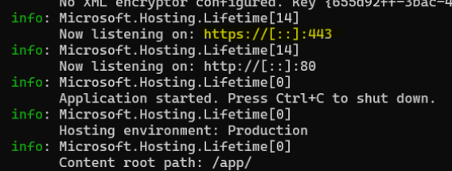

# ClickSharp

## EF Basic Startup Migrations
dotnet ef migrations add FirstInit --startup-project ClickSharp --project ClickSharp.DataLayer -- --environment DEBUG </br>
<br />
```bash
dotnet ef database update --startup-project ClickSharp --project ClickSharp.DataLayer -- --environment DEBUG
```

Steps on Azure:  
1. googleit->"azure for students"
2. create free account on *@student.put.poznan.pl domain
3. you should have azure for student subscription
4. create resources group
5. create sql server
6. create sql db
7. create app service
8. easy deploy from git repository

## To run Docker example with Windows PowerShell ->
  1. Requipments
		- .NET installed in local machine to crate a dev cert
		- Docker Desktop
  2. To run commands in PowerShell
      - creating develop cert (clean it first if there is already present)

		```powershell
			dotnet dev-certs https --clean
			dotnet dev-certs https -ep "$env:USERPROFILE\.aspnet\https\clicksharpapp.pfx"  -p 321haslo0
			dotnet dev-certs https --trust
		```
		please notice password must match with docker-compose.yml configuration

	  - build with docker compose

		```powershell
			cd C:\YourRepoPath\ClickSharp
			docker compose up
		```

	  - or rebuild with

    	```powershell
			docker compose up --build
		```

  3. Expected result
        - 
  4. Aditional information -> on some browsers port 8001:80 might not work local because of redirection to https,
  which on client side should be 8002 but in docker-image is 443.
  Browser might prevent this action and setup back to default 443.
  This is normal behavior, you should always use 8002 only.
  5. Sources that might help if any problems
    	- https://learn.microsoft.com/en-us/aspnet/core/security/docker-compose-https?view=aspnetcore-7.0
		- https://learn.microsoft.com/en-us/dotnet/core/tools/dotnet-dev-certs